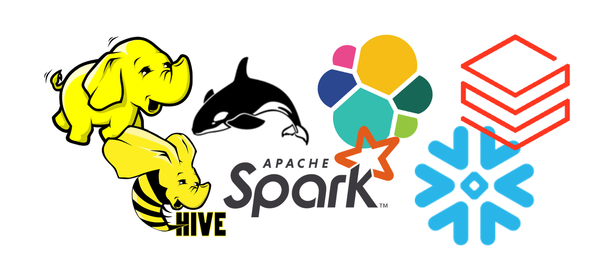
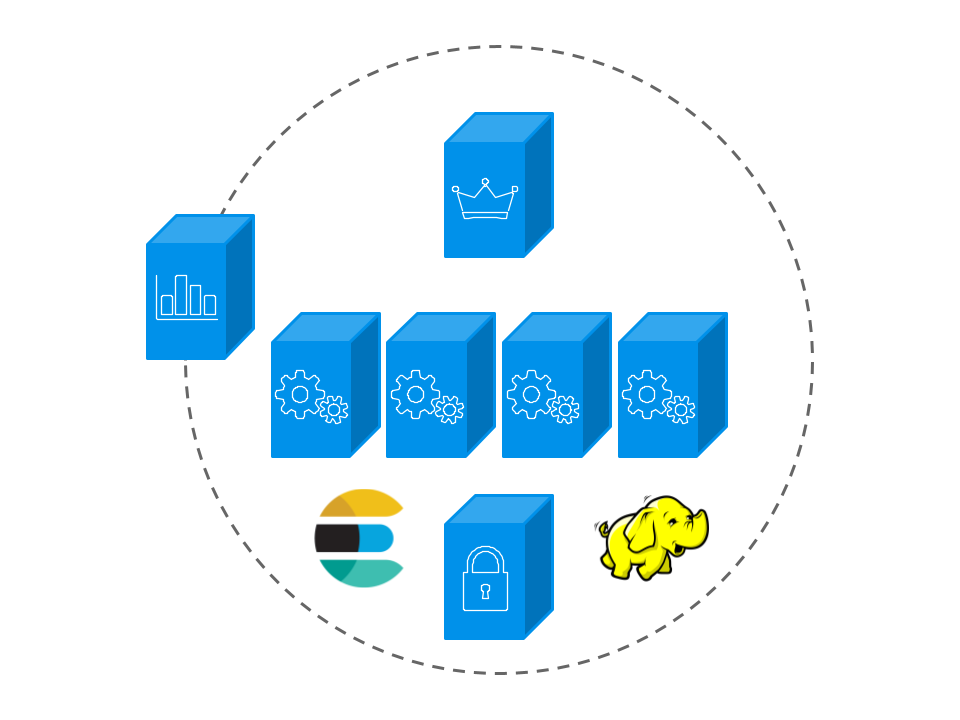
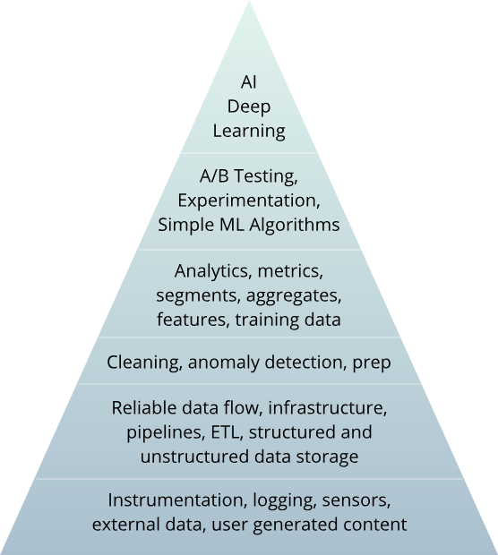

# Introduction to Big Data

Data, and the insight it offers, is essential for business to innovate and differentiate. Coming from a variety of sources, from inside the firewall out to the edge, the growth of data in terms of volume, variety and speed leads to innovative approaches. Today, Data Lakes allow organizations to accumulate huge reservoirs of information for future analysis. At the same time, the Cloud provides easy access to technologies to those who do not have the necessary infrastructure and Artificial Intelligence promises to proactively simplify management.

With Big Data technologies, Business Intelligence is entering a new era. Hadoop and the likes, NoSQL databases, and Cloud managed infrastrutures store and represent structured and unstructured data and time series such as logs and sensors. From collect to visualization, the whole processing chain is processed in batch and real time.



## Basic knowledge: Information Systems

What is an Information System (IS)?

- Collect data
- Process it
- Store it
- Distribute it

## Basic knowledge: Distributed systems

A distributed system is a group of computers that appear as a unique and coherent system to the end user.

## Basic knowledge: Horizontal vs vertical scaling

- Vertical scaling: increase the size of the servers = more RAM, more powerful CPUs, more disk space, etc.
- Horizontal scaling: increase the number of server instead of ther size. Works for distributed systems.

## Basic knowledge: Data structure

- **Structured:** RDBMS tables, Excel

- **Semi-structured:** JSON, XML, CSV

  ```json
  [
      {
          "lastname": "LEONARD",
          "firstname": "Gauthier",
          "age": 26,
          "missions": ["Autodistribution"]
      },
      {
          "lastname": "TATA",
          "firstname": "Toto",
          "age": "33"
      }
  ]
  ```

  ```
  lastname,firstname,age,missions
  LEONARD,Gauthier,26,Autodistribution
  ```

- **Unstructured:** plain text, images, sound

## History of data

70's - 00's: RDBMS (Relational DataBase Management System)

- Data created and used only by technical people
- Non human readable
- Strongly typed

2000-2005: Internet rises (Web 1.0)

- Access to data
- Readable data, unstructured data
- Beginning of NoSQL

2005-today: Social networks (Web 2.0), customer 360

- Data explosion
- Data created and used by everyone
- End of Moore law

## Distributed systems

Advantages:

- Scalability
- Availability
- Flexibility

Disadvantages:

- Harder to architecture
- Harder to use
- Harder to maintain

## Big Data: The 3 Vs

- Volume
- Velocity
- Variety
- ... and friends

## Big Data: The 3 Vs - Volume

- It doesn’t fit in a RDBMS (TB, PB)
- **It cannot be processed by one machine**
- E.g. 1 day at Facebook:
  - 3 billions + content elements
  - 4 PB + of new data

## Big Data: The 3 Vs - Velocity

- To save and process all the all data generated
  - E.g. Google processes 100 million pages per day
- To deliver near real time results
  - E.g. Google search results < 0.1 sec, Facebook Messenger

## Big Data: The 3 Vs - Variety

- All type of data
- 20% structured or semi-structured, 80% unstructured

## Why do we need Big Data?

- If **business critical** for the company
- Other companies:
  - Take advantage of all the data sitting in all places of the company
  - Centralize storage and compute in one place

## Big Data clusters

- Cluster: Group of connected computers/servers that can be viewed as a single system
- Master-slave model
- Examples of Big Data platforms:
  - Apache Hadoop
  - Elasticsearch



## The Hadoop Ecosystem

- A stack of **Open Source softwares** offering all the functionalities needed to build a [Data Lake](https://en.wikipedia.org/wiki/Data_lake) and exploit the data stored in it. Most of the Hadoop projects are maintained by the [Apache Software Foundation](https://apache/org) and can be found on [their GitHub](https://github.com/apache).
- Nearly are built using **Java** or at least run in the **JVM** (Java Virtual Machine)
- Preferred execution environment: **Linux**

### Software stack

- Distributed Filesystem: HDFS
- Cluster Manager: YARN
- Execution Engines: MapReduce, Tez, Spark
- Warehouse / SQL: Hive
- NoSQL DB: HBase
- And other stuff

## Data jobs: Data Analyst

- Business intelligence
- Data Mining
- Visualization, graphs
- SQL / BI Tools

## Data jobs: Data Scientist

- Machine Learning / Deep Learning
- Data Mining / Feature engineering - Visualization
- SQL / Python / R

### The Data Science hierarchy of needs

- Learn, optimize
- Aggregate, label
- Explore, transform
- Move, store
- Collect



## Data jobs: Data Engineer

Data Engineers are in charge of building the infrastructure to deliver, store and process the data. He collect, move, store and prepare the data.

- Data ingestion and storage
- Data pipelines and orchestration - Optimization
- Assist Data Analysts & Data Scientists to apply best practices
- Hive / Spark / Storage / Pipelines

## Data jobs: Data Architect

- Data Lake architecture
- Components installation and monitoring
- Ensure the data is securely accessed and governed
- Knowledge of all available Big Data tools

## Data jobs: Data Something...

- Data Steward
- Chief Data Officer
- ML Engineer

## Resources

- [Data Engineering](https://www.adaltas.com/en/skills/data-engineering/)
- [Data Science](https://www.adaltas.com/en/skills/data-science/)
- [How to become a Data Engineer](https://khashtamov.com/en/how-to-become-a-data-engineer/) (jan 2020)
